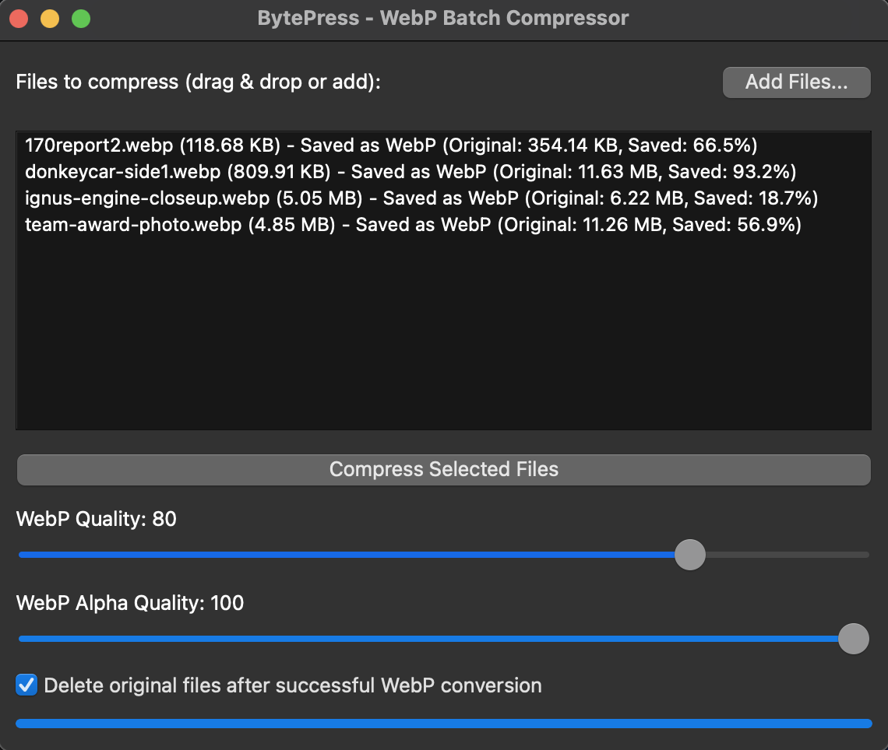

# BytePress: High-Performance File Compression Utility

A fast and user-friendly C++ GUI application for compressing and decompressing files, built with Qt 6. BytePress is designed to be efficient and intuitive, offering modern compression algorithms, with a special focus on optimizing images for web use via the WebP format.



## Core Features

*   **Intuitive GUI:** Easy-to-use graphical interface built with Qt 6.
*   **Multiple Compression Algorithms:** Supports various strategies for different file types (architecture allows for new strategies to be added).
*   **WebP Optimization:** Specialized for converting and compressing images to the highly efficient WebP format, ideal for reducing website load times while maintaining quality.
*   **Cross-Platform:** Can be built and run on Windows, macOS, and Linux.

## Ideal for Website Optimization with WebP

WebP is a modern image format developed by Google that provides superior lossless and lossy compression for images on the web. Using WebP can significantly reduce image file sizes compared to older formats like JPEG and PNG, leading to:

*   **Faster Page Loads:** Smaller images mean users download less data, making your website feel snappier.
*   **Reduced Bandwidth Consumption:** Saves hosting costs and is beneficial for users on limited data plans.
*   **Excellent Quality:** WebP offers impressive compression ratios while maintaining high visual quality.
*   **Alpha Channel Support:** Supports transparency in both lossless and lossy modes, often with much smaller file sizes than PNG.

BytePress helps you leverage these benefits by providing a simple way to convert your existing image assets (PNG, JPEG, etc.) into the WebP format, ready for web deployment.

### Supported Input Formats for WebP Conversion

BytePress currently supports converting the following image formats to WebP:

*   PNG (.png)
*   JPEG (.jpg, .jpeg)
*   GIF (.gif)
*   AVIF (.avif)
*   HEIF/HEIC (.heif, .heic)

## Prerequisites

Before building BytePress, you need to install the following system dependencies:

*   **Qt 6 Development Libraries:** (Version 6.2 or newer recommended)
*   **A C++ Compiler:** Supporting C++17 (e.g., GCC, Clang).
*   **Make/Build Tools:** (e.g., GNU Make, nmake, jom).

### Platform-Specific Dependency Installation

**macOS:**

1.  **Xcode Command Line Tools:** If you don't have them, open Terminal and run:
    ```bash
    xcode-select --install
    ```
2.  **Qt 6:** The easiest way is via Homebrew:
    ```bash
    brew install qt@6
    ```
    Ensure `qt@6/bin` is in your PATH, or use the full path to qmake (e.g., `/usr/local/opt/qt@6/bin/qmake`).

**Windows:**

1.  **Qt 6 & MinGW Compiler:** Download the Qt Online Installer from the official Qt website.
    *   During installation, select a Qt 6 version (e.g., 6.6.x).
    *   Under the Qt version, ensure you select the **MinGW** toolchain (e.g., "MinGW [version] 64-bit"). This will install Qt libraries pre-built for MinGW and usually includes the MinGW compiler suite itself.
    *   Also select "Qt Creator" if you wish to use the Qt IDE.
2.  **Build Tools:**
    *   The MinGW compiler (g++.exe) and make utility (`mingw32-make.exe`) should be installed as part of the Qt MinGW package. You'll find them in a subdirectory like `C:\Qt\[QtVersion]\[MinGWVersion]\bin\`.
    Ensure this directory (containing `qmake.exe`, `g++.exe`, and `mingw32-make.exe`) is added to your system's PATH environment variable for easier command-line access.

**Linux:**

*   **Build Tools:**
    ```bash
    sudo apt-get update
    sudo apt-get install build-essential # For Debian/Ubuntu
    # Or for Fedora:
    # sudo dnf groupinstall "C Development Tools and Libraries"
    ```
*   **Qt 6 Development Libraries:**
    ```bash
    sudo apt-get install qt6-base-dev qt6-tools-dev # For Debian/Ubuntu
    # Or for Fedora (package names might vary, e.g., qt6-qtbase-devel):
    # sudo dnf install qt6-qtbase-devel qt6-qttools-devel
    ```

## Building BytePress

1.  **Clone the repository:**
    ```bash
    git clone <your-repository-url>
    cd bytepress
    ```

2.  **Run qmake to generate the Makefile:**
    *   On macOS and Linux:
        ```bash
        qmake # Run at project root where bytepress.pro is
        # Or specify the path if needed, e.g., /usr/local/opt/qt@6/bin/qmake
        ```
    *   On Windows (adjust path to qmake if not in PATH):
        ```bash
        C:\Qt\6.x.x\mingw_xx\bin\qmake.exe # For MinGW
        ```

3.  **Compile the project:**
    *   On macOS and Linux:
        ```bash
        make -j$(nproc) # nproc might not be available on macOS, use a number e.g., make -j4
        ```
    *   On Windows:
        *   For MinGW:
            ```bash
            mingw32-make -j4
            ```

4.  **Run the application:**
    The executable (`bytepress`, `bytepress.exe`) will be located in the `build` directory or a platform-specific subdirectory within it (e.g., `build/debug` or `build/release`).

## Contributing

Contributions are welcome! Please feel free to submit pull requests, create issues for bugs or feature requests.

1.  Fork the repository.
2.  Create your feature branch (`git checkout -b feature/AmazingFeature`).
3.  Commit your changes (`git commit -m 'Add some AmazingFeature'`).
4.  Push to the branch (`git push origin feature/AmazingFeature`).
5.  Open a Pull Request.

## License

This project is licensed under the MIT License. See the [LICENSE](LICENSE.md) file for the full license text.

```text
MIT License

Copyright (c) 2025 Alexander Bijan Ardalan

Permission is hereby granted, free of charge, to any person obtaining a copy
of this software and associated documentation files (the "Software"), to deal
in the Software without restriction, including without limitation the rights
to use, copy, modify, merge, publish, distribute, sublicense, and/or sell
copies of the Software, and to permit persons to whom the Software is
furnished to do so, subject to the following conditions:

The above copyright notice and this permission notice shall be included in all
copies or substantial portions of the Software.

THE SOFTWARE IS PROVIDED "AS IS", WITHOUT WARRANTY OF ANY KIND, EXPRESS OR
IMPLIED, INCLUDING BUT NOT LIMITED TO THE WARRANTIES OF MERCHANTABILITY,
FITNESS FOR A PARTICULAR PURPOSE AND NONINFRINGEMENT. IN NO EVENT SHALL THE
AUTHORS OR COPYRIGHT HOLDERS BE LIABLE FOR ANY CLAIM, DAMAGES OR OTHER
LIABILITY, WHETHER IN AN ACTION OF CONTRACT, TORT OR OTHERWISE, ARISING FROM,
OUT OF OR IN CONNECTION WITH THE SOFTWARE OR THE USE OR OTHER DEALINGS IN THE
SOFTWARE.
```
